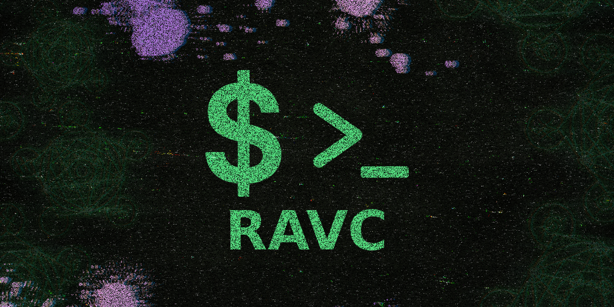

<div align="center">

<a href="https://www.npmjs.com/package/ravc" target="_blank"></a>  
 <a href="https://www.npmjs.com/package/ravc" target="_blank"></a>
</div>

---

<div align="center">

## 🚀 RAVC

> ⚙️ CLI/NPM para Conversão de Moedas USD/BRL & Cotação em tempo real.

[](https://www.npmjs.com/package/ravc)
[](https://nodejs.org)
[](LICENSE)

*Biblioteca NPM + CLI*

</div>



---

## 📋 Visão Geral

O **RAVC** é uma ferramenta de linha de comando (CLI) e NPM que oferece conversão de moedas e monitoramento em tempo real das cotações USD/BRL, com interface interativa e visualmente atrativa.

## 🏗️ Estrutura do Projeto

```
ravc/ 🌟
├── 📁 bin/
│   └── 🚀 cli.js
├── 📁 lib/
│   ├── 📁 config/
│   │   ├── ⚙️ app.json
│   │   ├── 🎨 colors.js
│   │   ├── 🔧 logger.json
│   │   ├── 🕷️ scraping.json
│   │   └── 🎭 ui.json
│   ├── 📁 utils/
│   │   ├── 📦 box.js
│   │   ├── 📝 logger.js
│   │   └── 📦 packageInfo.js
│   ├── 💱 converter.js
│   ├── 🏠 index.js
│   ├── 🕷️ scraper.js
│   ├── 🎨 ui.js
│   └── 🔄 updater.js
├── 📄 package.json
└── 📖 README.md
```

## 📦 Instalação Rápida

<details>
<summary>📥 Como instalar o NodeJS?</summary>

- [COMO INSTALAR NODE JS NO WINDOWS?](https://youtu.be/-jft_9PlffQ)


</details>

```bash
# Instalar globalmente
npm i -g ravc         # ✅ Recomendado
npm install -g ravc   # ✅ Completo
```

## 🗑️ DESINSTALAR GLOBALMENTE

```bash
npm un -g ravc        # ✅ Recomendado  
npm uninstall -g ravc # ✅ Completo
npm remove -g ravc    # ✅ Alternativo
```

## 💻 Como Usar

### 🎮 Modo Interativo (Recomendado)

```bash
ravc
```
*Menu completo com todas as funcionalidades*

### ⚡ Comandos Diretos

```bash
# Google Finance direto
ravc google
ravc -g

# Banco Central direto  
ravc bacen
ravc -b

# Modo atualização contínua
ravc update
ravc -u

# Ajuda
ravc help
ravc -h
```

### 🔄 Modo Atualização Contínua

```bash
ravc update
```
*Atualiza automaticamente a cada minuto com logs em tempo real*

## 🎯 Funcionalidades

### 💱 Conversão de Moedas
- USD → BRL e BRL → USD
- Formatação monetária adequada
- Validação de entrada

### 📈 Monitoramento
- Variações em tempo real
- Direção (alta/baixa/estável)
- Percentuais de mudança
- Timestamps precisos

### 📊 Logs e Histórico
- Logs em arquivo .txt legíveis
- Histórico de sessões
- Estatísticas de variação
- Backups em JSON

## 🔧 Desenvolvimento

### 📦 Dependências Principais
- `playwright` - Web scraping
- `inquirer` - Interface interativa  
- `boxen` - Boxes estilizados
- `chalk` - Cores no terminal
- `figlet` - Banner ASCII


## 🐛 Solução de Problemas

### 🔍 Debug Mode
```bash
# Ativar logs detalhados
DEBUG=1 ravc

# Debug específico do scraping  
DEBUG_SCRAPING=1 ravc
```

### ❌ Problemas Comuns

**Erro de permissão no NPM:**
```bash
# Linux/Mac
sudo npm install -g ravc

# Windows (Admin)
npm install -g ravc
```

**Playwright não instalado:**
```bash
npx playwright install
```

## 📄 Licença

Este projeto está sob a licença MIT. Veja o arquivo [LICENSE](LICENSE) para detalhes.

---

<div align="center">

**✨ Feito com 💚 por [RavenaStar](https://ravenastar.link)**

[⭐ Dê uma estrela no GitHub!](https://github.com/ravenastar-js/ravc)

</div>

---

## Star History

<a href="https://www.star-history.com/#ravenastar-js/ravc&Date">
 <picture>
   <source media="(prefers-color-scheme: dark)" srcset="https://api.star-history.com/svg?repos=ravenastar-js/ravc&type=Date&theme=dark" />
   <source media="(prefers-color-scheme: light)" srcset="https://api.star-history.com/svg?repos=ravenastar-js/ravc&type=Date" />
   
 </picture>
</a>